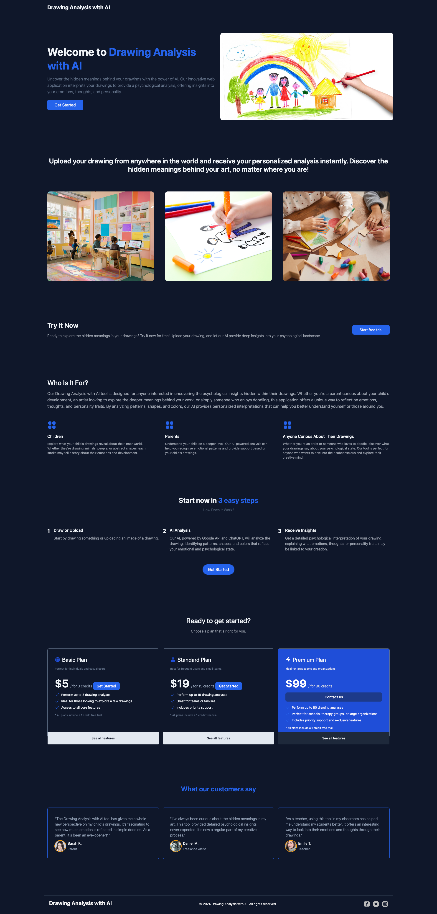
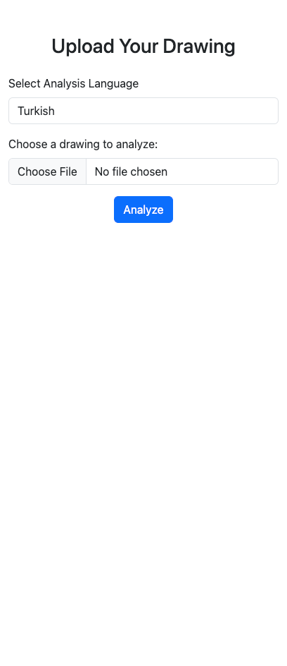
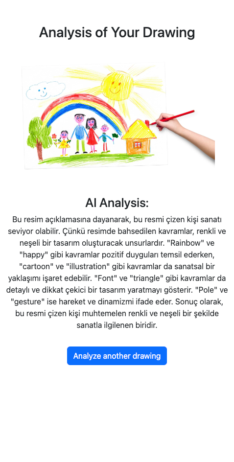

# Drawing Analysis with AI

Drawing Analysis with AI is a web application that leverages Google API and OpenAI's GPT-4 to analyze drawings. The app provides psychological interpretations of the drawings, offering users insights into the possible emotions and mental states reflected in their artwork.

### Key Features:

- Drawing Upload: Users can upload their drawings in image format.
- AI-Powered Analysis: The application uses Google's Vision API to process the image and Chat GPT to provide psychological interpretations based on the details of the drawing.
- Target Audience: Parents, children, and anyone curious about the psychological meanings behind their drawings.
- Language Support: The app supports multiple languages. Users can select from the 10 most common languages plus Turkish for analysis.

### How It Works:

- Upload a Drawing: Users upload their drawing using the provided interface.
- AI Analysis: The application analyzes the drawing using Google’s Vision API to extract features.
- Psychological Interpretation: Based on the drawing features, OpenAI's GPT-4 provides a psychological analysis of the emotions or themes present in the drawing.
- Results: Users receive a detailed interpretation of their drawing’s potential psychological meaning.

### Technologies Used:
- Laravel (PHP), Google Vision API, OpenAI GPT-3.5, MySQL, Docker (with Apache and MySQL services)

## Installation & Setup:

- Clone the repository: git clone https://github.com/yourusername/drawing-analysis-ai.git

### Navigate to the project directory:

- cd drawing-analysis-ai

### Install dependencies:

- composer install
- npm install

Set up environment variables by duplicating .env.example to .env and fill in the required fields.

### Start the application using Docker:

- docker-compose up

Open the application in your browser at http://localhost:8080

----------

# Yapay Zeka ile Çizim Analizi

Yapay Zeka ile Çizim Analizi, Google API ve OpenAI GPT-4’ü kullanarak çizimlerinizi analiz eden bir web uygulamasıdır. Uygulama, çizimlerinize dair psikolojik yorumlar sunarak, sanatınızda yansıttığınız duygular ve zihinsel durumlar hakkında ipuçları verir.

## Ana Özellikler:

- Çizim Yükleme: Kullanıcılar, çizimlerini resim formatında yükleyebilir.
- Yapay Zeka Tabanlı Analiz: Uygulama, çizimi işlemek için Google Vision API'sini, psikolojik yorumlar için ise Chat GPT'yi kullanır.
- Hedef Kitle: Çocuklar, ebeveynler ve çizimlerinin psikolojik anlamlarını merak eden herkes.
- Dil Desteği: Uygulama, analiz için Türkçe ve en yaygın 10 dil dahil olmak üzere çoklu dil desteği sunar.

### Nasıl Çalışır:

- Bir Çizim Yükleyin: Kullanıcılar, sağlanan arayüzü kullanarak çizimlerini yükler.
- Yapay Zeka Analizi: Uygulama, çizim özelliklerini çıkarmak için Google Vision API'yi kullanır.
- Psikolojik Yorum: Çizim özelliklerine dayalı olarak, OpenAI GPT-4, çizimdeki duygular veya temalar hakkında psikolojik bir analiz sunar.
- Sonuçlar: Kullanıcılar, çizimlerinin olası psikolojik anlamlarına dair ayrıntılı bir yorum alır.

### Kullanılan Teknolojiler:

- Laravel (PHP), Google Vision API, OpenAI GPT-3.5, MySQL, Docker (with Apache and MySQL services)

## Kurulum & Başlatma:

- Depoyu klonlayın: git clone https://github.com/yourusername/drawing-analysis-ai.git

- Proje dizinine gidin: cd drawing-analysis-ai

### Bağımlılıkları yükleyin:

- composer install
- npm install

.env.example dosyasını .env olarak kopyalayın ve gerekli alanları doldurun.

### Uygulamayı Docker ile başlatın:
- docker-compose up

Tarayıcınızda http://localhost:8080 adresini açarak uygulamaya erişebilirsiniz.